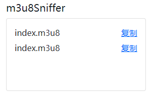
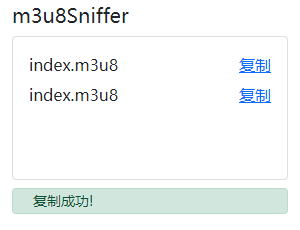
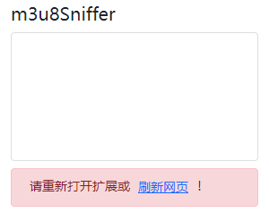

# m3u8Sniffer
## 中文  
一个可以嗅探网页m3u8链接请求的Manifest V3版本Chrome扩展。  

由于Manifest V3取消了background.js常驻后台的特性，改用service worker，所以该扩展目前存在以下缺陷：  

1. 必须在页面加载完成以后和service worker销毁之前打开m3u8Sniffer  

2. 可能会因为service worker销毁而出现链接丢失的情况  

storage可以用来存储数据，但是又必须考虑清空storage的时机，因为m3u8Sniffer需要的是运行时的临时存储，而不是永久存储，目前没有想到更好的方案。  

## English  
A Chrome extension of manifest V3 that can sniff web m3u8 link requests.  

Since manifest V3 cancels the resident background feature of background and uses service worker instead, the extension currently has the following defects:  

1. Open m3u8sniffer after the page is loaded and before the service worker is destroyed.  

2. The link may be lost due to the destruction of the service worker.  

Storage can be used to store data, but the time to empty storage must be considered, because m3u8sniffer needs temporary storage at runtime rather than permanent storage. At present, there is no better scheme.

